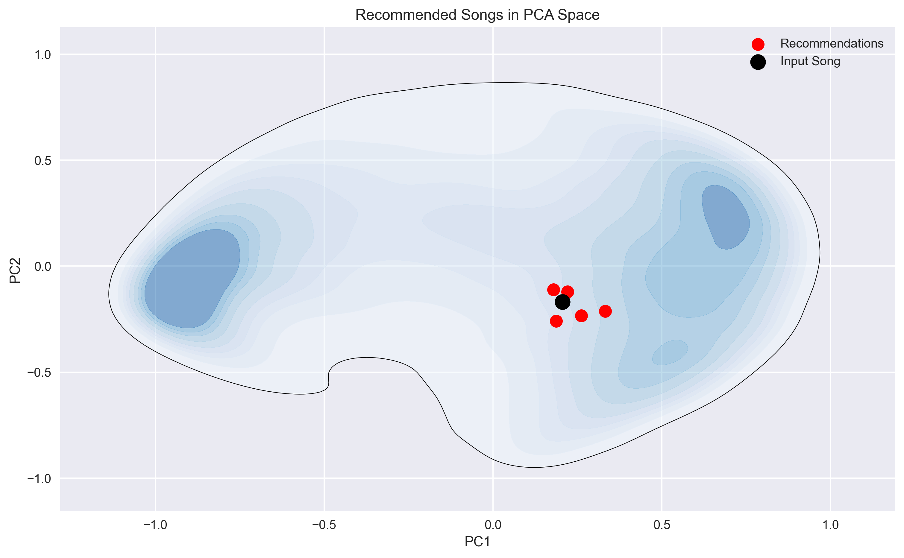
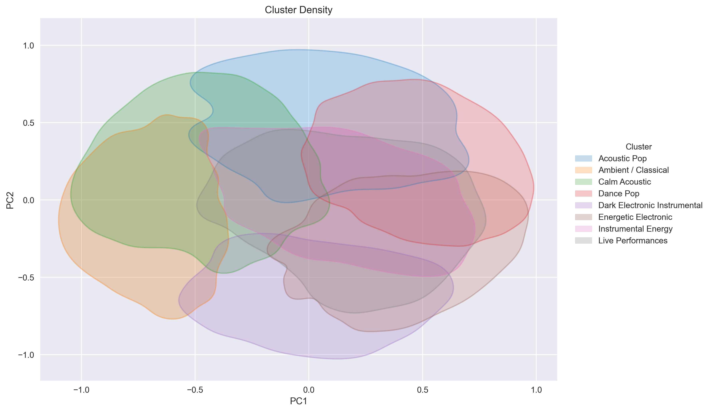

# Music Recommendation System

## Overview
This project builds a content-based music recommendation system using Spotify audio features. \
The system identifies similar songs using nearest neighbor search in a standardized feature space.

## Dataset
The dataset contains Spotify audio features for over one million songs. \
Each track is described by numerical attributes that capture musical characteristics such as rhythm, energy and mood. For example:

- danceability
- energy
- loudness
- acousticness
- instrumentalness
- tempo
- valence

The full dataset used in this project is available on Kaggle: \
-> https://www.kaggle.com/datasets/rodolfofigueroa/spotify-12m-songs/data

To ensure reproducibility, a smaller sample of the dataset is included in the repository.

## Methodology
The recommendation system follows these steps:

1. Data preprocessing and cleaning
2. Exploratory data analysis
3. Feature standardization
4. Nearest neighbor search using euclidean distance
5. Visualization of song similarity using PCA
6. Clustering the songs using K-means

## Example Recommendation
Example: Recommendations for **90210 (feat. Kacy Hill) - Travis Scott, Kacy Hill**

| Song | Year |
|------|------|
| Stock Photo Girl – Nerf Herder | 2016 |
| Monolith – Josh Klinghoffer, Chad Smith | 2019 |
| Girl Next Door – Luke Child | 2017 |
| No Love – Tommy Lee Sparta | 2013 |
| Nowhere – Chris Brown | 2017 |

## Visualization
Visualization: Recommendation for **90210 (feat. Kacy Hill) - Travis Scott, Kacy Hill** in a PCA-Space. \
The PCA plot below shows how songs are distributed in the feature space. \
Recommended songs appear close to the input track in the reduced two-dimensional representation. \

Visualization: Clustering Analysis \
The clustering was done by utilizing the K-means algorithm. \
It shows how songs are grouped by distinct audio features without predefined genre labels. \

## Limitations
The recommender is purely content-based and relies only on audio features. \
It does not incorporate user listening history or collaborative filtering.

## Future Work
Possible improvements include:

- hybrid recommender systems
- approximate nearest neighbor search

For the full analysis see the notebook: \
-> [notebook/analysis.ipynb](https://github.com/kubaamarczak/music-recommendation-system/blob/main/notebooks/analysis.ipynb)

